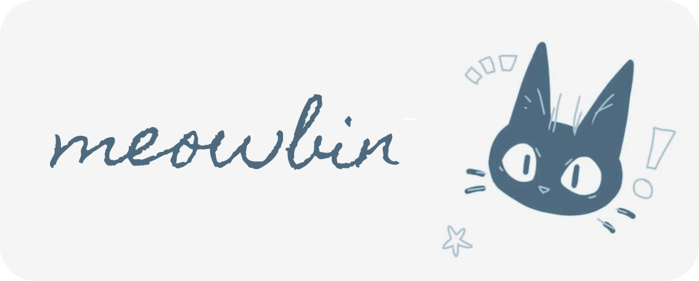

                            

<samp>
meowbin: a simple interactive notebin web app
</samp>

<samp>

## features to be added!

- font formatting options
- the flexibility of choosing your own custom link
- an optional feature to protect the note with a password
- a live word count reader
- interactive visuals

</samp>

## screenshots!

will be added soon! :D